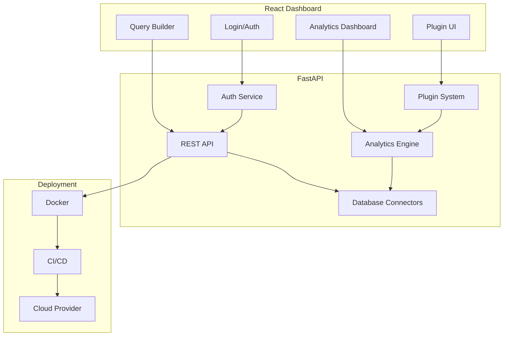

# Agentic Analytics Tool – System Design & Project Plan

## 1. Overview
A cloud-deployed web application for direct database insights, text and graphical analytics, supporting SQL Server, MySQL, PostgreSQL, and cloud databases. Extensible via custom analytics plugins.

---

## 2. High-Level Architecture

- **Backend:** Python (FastAPI), SQLAlchemy ORM, plugin manager, analytics engine, authentication service
- **Frontend:** React dashboard, query builder, analytics visualizations, plugin UI
- **Database Connectors:** pyodbc (SQL Server), pymysql (MySQL), asyncpg (PostgreSQL)
- **Plugin System:** API endpoints for plugin registration and execution
- **Authentication:** OAuth2/JWT, user roles
- **Deployment:** Docker, CI/CD, cloud provider support

---

## 3. Project Plan

- **Phase 1:** Requirements & Architecture
- **Phase 2:** Backend API & DB Integration
- **Phase 3:** Frontend Dashboard & Visualizations
- **Phase 4:** Authentication & Role Management
- **Phase 5:** Plugin System & Extensibility
- **Phase 6:** Cloud Deployment & CI/CD
- **Phase 7:** Documentation & Testing

---

## 4. Design Specifications

### Backend
- FastAPI REST endpoints for data, analytics, plugins, auth
- SQLAlchemy ORM for DB abstraction
- Connection pooling and dynamic DB config
- Analytics engine for text, graphical, SQL insights
- Plugin manager with API for registration/execution

### Frontend
- React SPA with dashboard, query builder, analytics views
- Visualization: Chart.js, Plotly, D3.js
- Plugin UI integration
- Auth pages (login, role-based access)

### Authentication
- OAuth2/JWT for secure login
- Roles: admin, analyst, viewer
- RBAC for API and UI features

### Plugin System
- API for plugin registration, execution, management
- Extension points for analytics modules
- Security sandboxing for plugins

---

## 5. Tech Stack

- **Backend:** Python 3.11+, FastAPI, SQLAlchemy, pyodbc, pymysql, asyncpg, JWT, OAuth2
- **Frontend:** React 18+, Chart.js, Plotly, D3.js, Axios
- **Deployment:** Docker, GitHub Actions, AWS/Azure/GCP
- **Testing:** Pytest, Jest, React Testing Library

---

## 6. Consumption Methods

- **Web Dashboard:** Interactive analytics, query builder, plugin UI
- **REST API:** For integration with external systems, automation, plugin management
- **Plugin API:** Register and execute custom analytics modules

---

## 7. Integration Aspects

- **Database:** Dynamic config for SQL Server, MySQL, PostgreSQL, cloud DBs
- **Authentication:** OAuth2/JWT, integration with enterprise identity providers
- **Plugins:** API for third-party analytics modules, UI extension points
- **Cloud:** Dockerized deployment, CI/CD pipeline, environment variable config

---

## 8. Security & Compliance

- Secure authentication and RBAC
- Plugin sandboxing
- Encrypted DB credentials
- Audit logging for analytics actions

---

## 9. Extensibility

- Plugin system for custom analytics
- Modular backend and frontend architecture
- API for external integrations

---

## 10. Deployment

- Docker containers for backend/frontend
- CI/CD pipeline for automated builds/deployments
- Cloud provider options: AWS ECS/EKS, Azure Web Apps, GCP Cloud Run

---

## 11. Documentation

- API docs (OpenAPI/Swagger)
- User guides for dashboard and plugin development
- Deployment instructions
